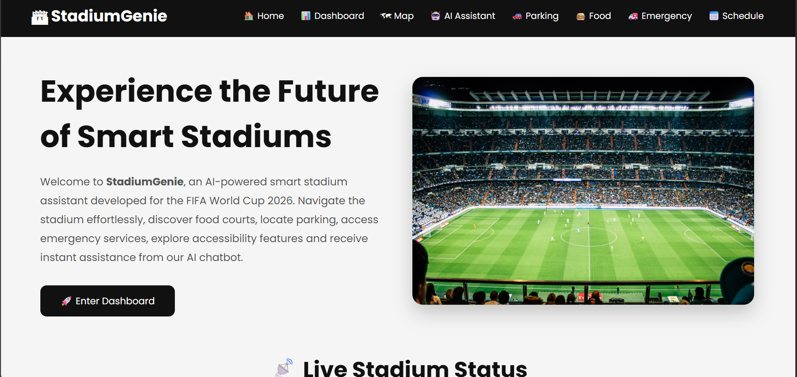
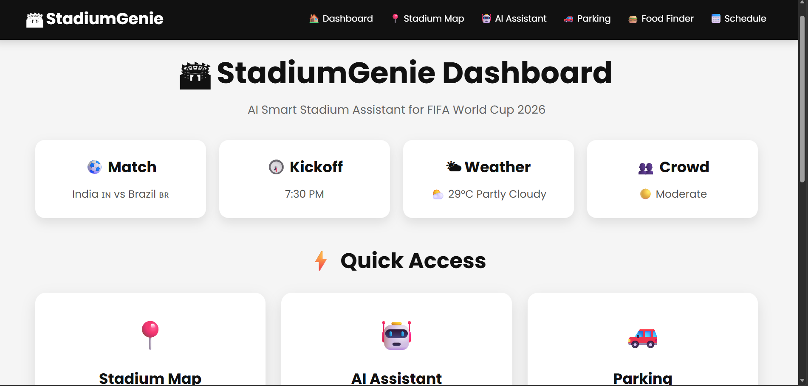
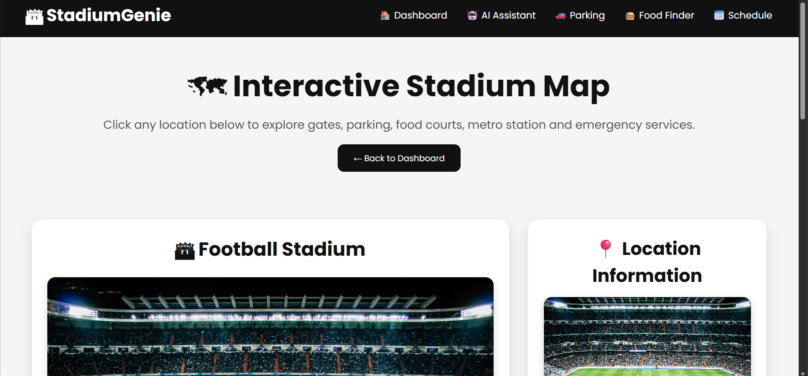
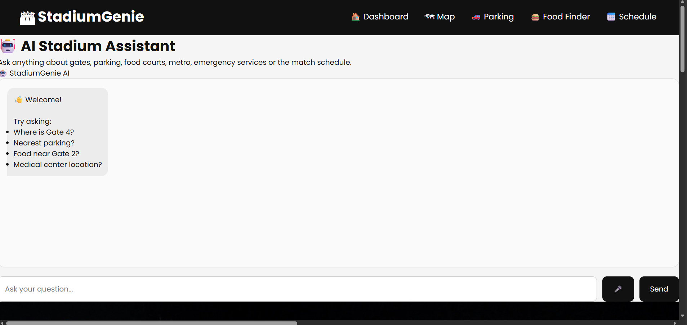
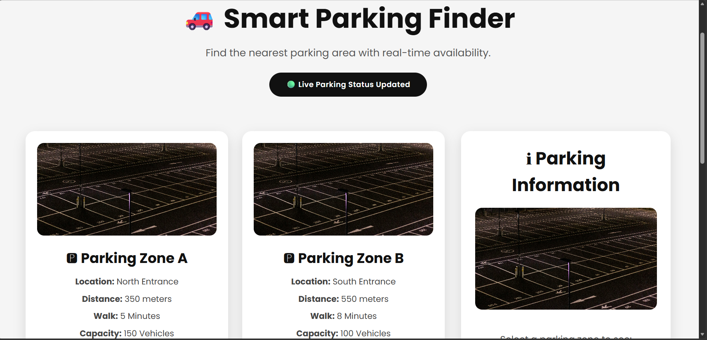
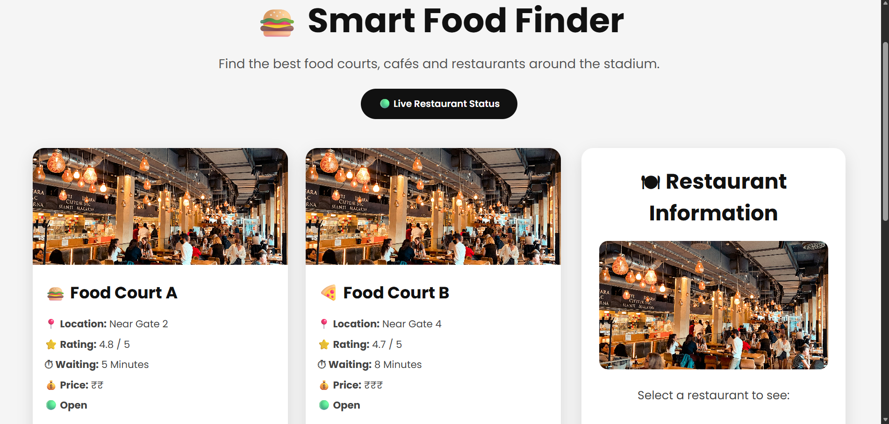
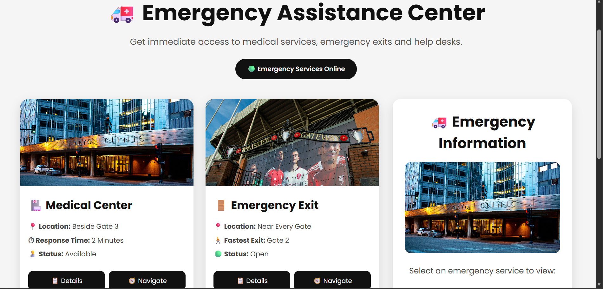
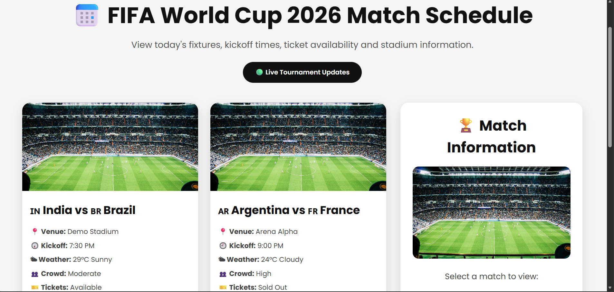

# 🏟 StadiumGenie
### AI Smart Stadium Assistant for FIFA World Cup 2026


# 📖 Overview

**StadiumGenie** is an AI-powered Smart Stadium Assistant designed to improve the fan experience during large sporting events such as the **FIFA World Cup 2026**.

The application helps visitors navigate the stadium, locate facilities, discover food courts, find parking, access emergency services, view match schedules, and receive instant assistance through an AI chatbot.

The project demonstrates how Artificial Intelligence and smart navigation can simplify stadium operations and enhance visitor convenience.


# 🎯 Problem Statement

Large stadiums often present several challenges for visitors:

- Difficulty finding gates and seating areas
- Long queues at food courts
- Confusion about parking availability
- Slow access to emergency services
- Lack of real-time navigation
- Limited accessibility information

**StadiumGenie** addresses these challenges by providing a centralized AI-powered digital assistant.


# 💡 Solution

StadiumGenie provides an interactive web application that allows visitors to:

- Navigate the stadium easily
- Locate gates and parking
- Discover nearby food courts
- Access emergency assistance
- View match schedules
- Ask the AI assistant stadium-related questions
- Improve the overall fan experience


# ✨ Features

## 🏠 Home Page
- Modern landing page
- Live stadium statistics
- Feature highlights
- Dashboard access


## 📊 Dashboard

Central hub providing access to:

- Stadium Map
- AI Assistant
- Smart Parking
- Food Finder
- Emergency Center
- Match Schedule


## 🗺 Interactive Stadium Map

Interactive cards for:

- Gate 1
- Gate 2
- Gate 3
- Gate 4
- Parking Zone A
- Parking Zone B
- Food Court A
- Food Court B
- Medical Center
- Metro Station

Displays:

- Images
- Description
- Facility Information


## 🤖 AI Assistant

Smart chatbot capable of answering questions about:

- Gates
- Parking
- Food Courts
- Metro
- Medical Services
- Wheelchair Accessibility
- Stadium Navigation


## 🚗 Smart Parking Finder

Displays:

- Parking availability
- Distance
- Walking time
- Recommended parking
- Live parking status


## 🍔 Food Finder

Provides:

- Food court locations
- Restaurant ratings
- Waiting time
- Menus
- Navigation


## 🚑 Emergency Center

Quick access to:

- Medical Centers
- Emergency Exits
- Help Desk
- Emergency Navigation


## 📅 Match Schedule

Displays:

- Match fixtures
- Kickoff time
- Weather
- Crowd level
- Ticket availability
- Countdown timer


# 🖥 Technologies Used

- HTML5
- CSS3
- JavaScript (ES6)
- Google Fonts
- Responsive Web Design


# 📂 Project Structure

```
StadiumGenie/

│

├── index.html

├── dashboard.html

├── map.html

├── chatbot.html

├── parking.html

├── food.html

├── emergency.html

├── schedule.html

│

├── css/

│   ├── style.css

│   ├── dashboard.css

│   ├── map.css

│   ├── chatbot.css

│   ├── parking.css

│   ├── food.css

│   ├── emergency.css

│   └── schedule.css

│

├── js/

│   ├── app.js

│   ├── chatbot.js

│   ├── map.js

│   ├── parking.js

│   ├── food.js

│   ├── emergency.js

│   └── schedule.js

│

├── images/

│   ├── stadium.jpg

│   ├── gate.jpg

│   ├── parking.jpg

│   ├── food.jpg

│   ├── metro.jpg

│   └── hospital.jpg

│

└── README.md
```


# 🚀 How to Run

1. Clone the repository

```bash
git clone https://github.com/Jan1827/StadiumGenie.git
```

2. Open the project folder

3. Open **index.html** in your browser

No installation is required.

---

# 📸 Screenshots

## 📸 Screenshots

### 🏠 Home Page



---

### 📊 Dashboard



---

### 🗺 Interactive Map



---

### 🤖 AI Assistant



---

### 🚗 Smart Parking



---

### 🍔 Food Finder



---

### 🚑 Emergency Center



---

### 📅 Match Schedule



Example:

```
screenshots/
    home.png
    dashboard.png
    map.png
    chatbot.png
```


# 🌍 Future Improvements

- Live Google Maps Integration
- Real-time Parking API
- QR Code Navigation
- Live Match Updates
- Multi-language Support
- Voice Assistant
- Ticket Scanner
- Crowd Density Detection
- AI Route Optimization
- Push Notifications


# 🎯 Use Cases

- Sports Stadiums
- Football World Cup
- Cricket Stadiums
- Concert Venues
- Olympic Games
- Large Event Management


# 📈 Benefits

✔ Faster Navigation

✔ Reduced Waiting Time

✔ Better Crowd Management

✔ Improved Visitor Experience

✔ Easy Facility Discovery

✔ Enhanced Emergency Response

✔ Accessible Stadium Experience


# 👩‍💻 Developed By

**Janhavi Ojha**

AI Smart Stadium Assistant Project


# 📜 License

This project is created for educational and hackathon purposes.


# ⭐ Support

If you found this project useful, consider giving it a ⭐ on GitHub.


# 🙏 Thank You

Thank you for exploring **StadiumGenie**!

Together, let's make stadium experiences smarter, safer, and more enjoyable with AI.