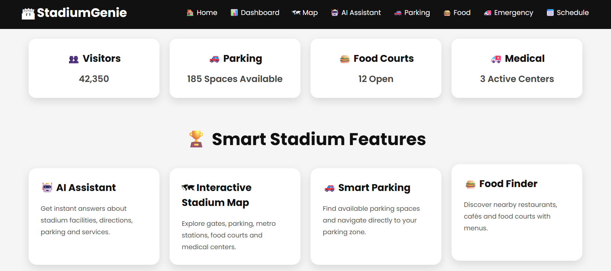
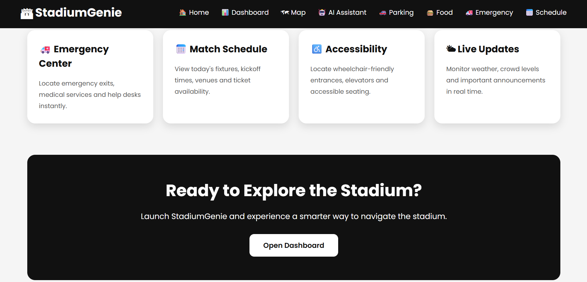
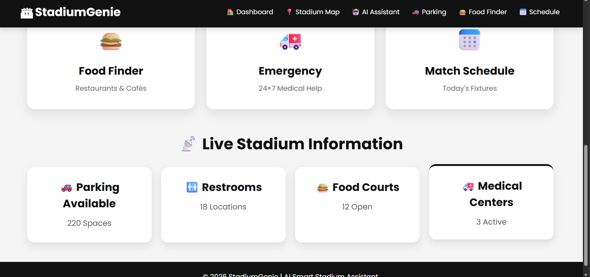
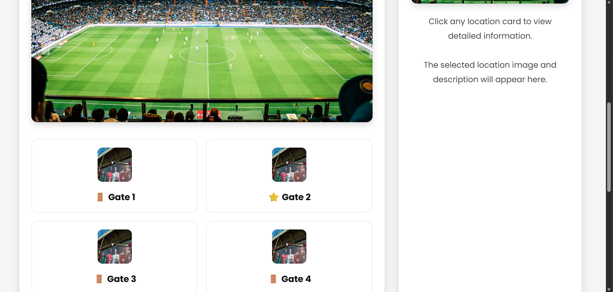
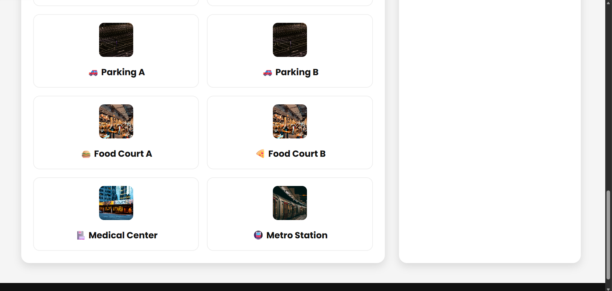
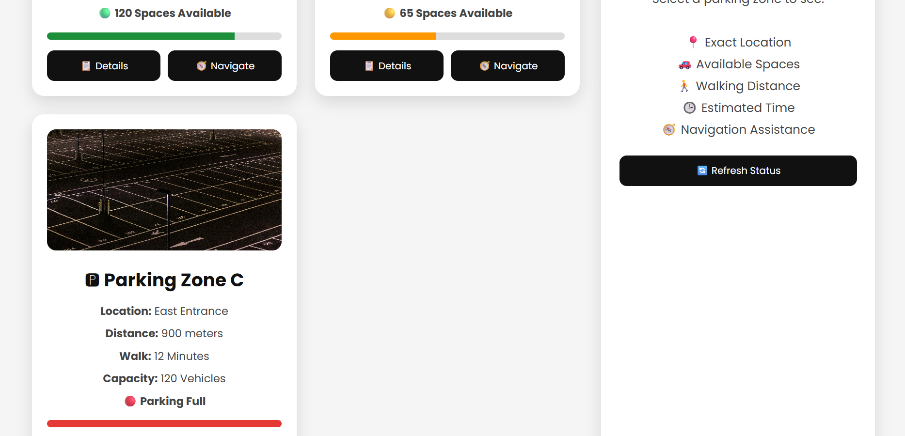
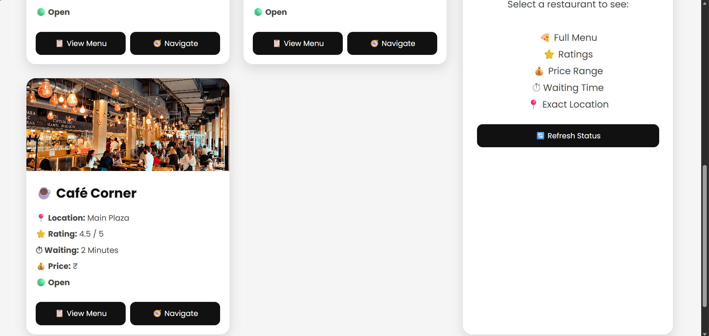
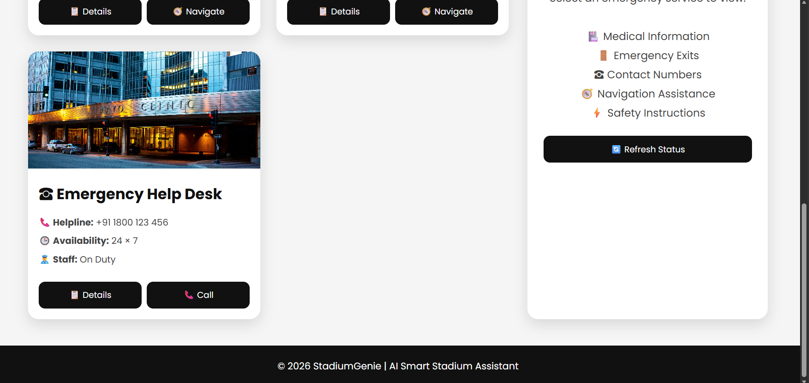
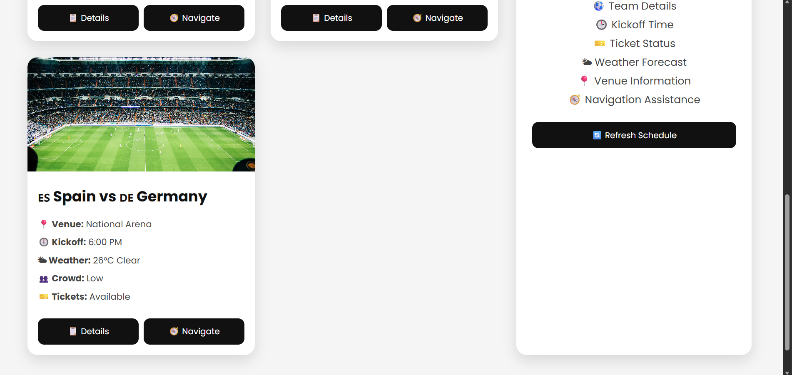

# 🏟️ StadiumGenie – AI Smart Stadium Assistant

<div align="center">


### 🤖 Your Smart Companion for a Seamless Stadium Experience

An AI-powered web application designed to improve the experience of spectators attending live sporting events. StadiumGenie helps visitors navigate the stadium, locate facilities, discover food courts, find parking, receive emergency guidance, and interact with an AI chatbot using both text and voice.

</div>

---

# 📑 Table of Contents

- [Project Overview](#-project-overview)
- [Problem Statement](#-problem-statement)
- [Solution](#-solution)
- [Key Highlights](#-key-highlights)
- [Features](#-features)
- [AI Integration](#-ai-integration)
- [System Architecture](#-system-architecture)
- [Technology Stack](#-technology-stack)
- [Project Structure](#-project-structure)
- [Installation](#-installation)
- [Environment Variables](#-environment-variables)
- [API Documentation](#-api-documentation)
- [Security Features](#-security-features)
- [Testing](#-testing)
- [Accessibility](#-accessibility)
- [Screenshots](#-screenshots)
- [Future Enhancements](#-future-enhancements)
- [Hackathon Submission](#-hackathon-submission)
- [Developer](#-developer)
- [License](#-license)

---

# 📖 Project Overview

Large sporting events such as the FIFA World Cup attract thousands of spectators. Visitors often struggle with:

- Finding stadium gates
- Locating food courts
- Finding restrooms
- Parking guidance
- Emergency assistance
- Match information
- Accessibility support

StadiumGenie is an AI-powered stadium assistant that solves these problems through an intuitive web application powered by Generative AI.

The application combines modern web technologies with AI to provide fast, interactive, and intelligent assistance for visitors.

---

# ❗ Problem Statement

Visitors attending major sporting events frequently experience:

- Confusion while navigating inside large stadiums
- Difficulty locating important facilities
- Long queues due to lack of guidance
- Delayed responses during emergencies
- Lack of real-time assistance
- Accessibility challenges for differently-abled visitors

Traditional static maps are difficult to use and cannot answer user-specific questions.

---

# 💡 Solution

StadiumGenie provides a centralized AI-powered assistant capable of:

- Answering stadium-related questions
- Providing navigation assistance
- Locating parking zones
- Finding food courts
- Guiding users to emergency facilities
- Supporting voice interaction
- Offering quick access to important match information

The system uses OpenRouter's Large Language Model to generate intelligent responses while also supporting a local knowledge base as a fallback for stadium-specific information.

---

# 🌟 Key Highlights

- 🤖 AI-powered chatbot
- 🎤 Voice input support
- 🔊 Text-to-Speech responses
- 🗺️ Interactive stadium map
- 🚗 Smart parking finder
- 🍔 Food court locator
- 🚑 Emergency assistance
- 📅 Match schedule
- 📍 Stadium navigation
- ♿ Accessibility information
- 🔒 Secure backend
- ⚡ Fast API responses
- 📱 Responsive user interface

---

# 🎯 Objectives

The primary objectives of StadiumGenie are:

- Improve visitor experience
- Reduce navigation confusion
- Provide AI-powered assistance
- Improve accessibility
- Support emergency situations
- Reduce waiting time for information
- Enhance fan engagement during events

---

# 👥 Target Users

- Football Fans
- Stadium Visitors
- Families
- Tourists
- Event Organizers
- Volunteers
- Security Personnel
- Emergency Response Teams

---
# ✨ Features

## 🏠 Smart Dashboard

The dashboard serves as the central hub of StadiumGenie and provides users with:

- Live match information
- Weather updates
- Stadium overview
- Quick navigation cards
- Access to all major services
- Responsive and modern interface

---

## 🤖 AI Chatbot

The AI chatbot enables users to ask stadium-related questions in natural language.

### Capabilities

- Stadium navigation
- Gate information
- Parking guidance
- Food court locations
- Restroom locations
- Emergency assistance
- Accessibility information
- Match-related queries
- General visitor assistance

The chatbot responds instantly using Generative AI while also supporting predefined stadium knowledge for reliable answers.

---

## 🎤 Voice Assistant

StadiumGenie supports voice-based interaction.

### Features

- Speech-to-Text
- Text-to-Speech
- Hands-free interaction
- AI-generated spoken responses
- Improved accessibility

Users can simply press the microphone button, ask a question, and receive both text and spoken responses.

---

## 🗺️ Interactive Stadium Map

The stadium map helps visitors navigate easily.

### Includes

- Stadium Gates
- Parking Zones
- Food Courts
- Restrooms
- Medical Center
- Metro Station
- Wheelchair Access
- VIP Lounge
- Team Store

Interactive hotspots allow users to quickly locate important facilities.

---

## 🚗 Smart Parking Finder

Visitors can quickly identify available parking areas.

Features include:

- Parking Zone A
- Parking Zone B
- Recommended parking based on stadium entrance
- Parking guidance
- Easy navigation

---

## 🍔 Food Court Locator

Helps visitors discover nearby food options.

Available information includes:

- Food Court A
- Food Court B
- Snacks
- Beverages
- Fast Food
- Seating Areas

---

## 🚑 Emergency Assistance

Provides immediate access to important emergency information.

Includes:

- Medical Center
- First Aid
- Emergency Contacts
- Exit Guidance
- Safety Instructions

---

## 📅 Match Schedule

Displays important match information such as:

- Match Name
- Kick-off Time
- Venue Information
- Schedule Overview

---

## ♿ Accessibility Support

Designed to improve accessibility for every visitor.

Features include:

- Wheelchair-accessible entrances
- Elevator information
- Accessible routes
- Voice interaction
- Clear navigation

---

# 🤖 AI Integration

StadiumGenie uses **OpenRouter AI** to provide intelligent responses to user queries.

## AI Workflow

```text
User
   │
   ▼
Frontend (HTML + CSS + JavaScript)
   │
POST /chat
   │
Node.js + Express Server
   │
OpenRouter AI API
   │
AI Response
   │
Displayed to User
```

---

## AI Features

- Natural Language Understanding
- Intelligent Question Answering
- Context-aware Responses
- Stadium Information Assistance
- Voice Interaction Support

---

## Local Knowledge Base

To improve reliability, StadiumGenie also includes a local knowledge base containing predefined information such as:

- Gates
- Parking
- Food Courts
- Medical Centers
- Restrooms
- Wheelchair Access
- Metro Station

If AI services are unavailable, the application can still answer common stadium-related questions using local data.

---

# 🏗️ System Architecture

```text
                    User
                      │
                      ▼
            StadiumGenie Frontend
       HTML • CSS • JavaScript
                      │
             Fetch API (POST)
                      │
                      ▼
            Node.js + Express Server
                      │
      ┌───────────────┴───────────────┐
      │                               │
      ▼                               ▼
OpenRouter AI API             Local Knowledge Base
      │                               │
      └───────────────┬───────────────┘
                      ▼
               AI Response Returned
                      │
                      ▼
             Displayed to User
```

---

# 💻 Technology Stack

## Frontend

- HTML5
- CSS3
- JavaScript (ES6)

---

## Backend

- Node.js
- Express.js

---

## AI

- OpenRouter API
- Large Language Model (LLM)

---

## Security

- Helmet
- Express Rate Limit
- Input Validation
- Request Size Limiting
- API Timeout Handling

---

## Testing

- Jest
- Supertest

---

## Tools

- Visual Studio Code
- Git
- GitHub
- Postman

---

# 📂 Project Structure

```text
StadiumGenie/
│
├── img/
│
├── public/
│   ├── dashboard.html
│   ├── chatbot.html
│   ├── map.html
│   ├── parking.html
│   ├── food.html
│   ├── emergency.html
│   ├── schedule.html
│   ├── styles.css
│   └── script.js
│
├── tests/
│   └── server.test.js
│
├── server.js
├── package.json
├── package-lock.json
├── .env
├── .gitignore
└── README.md
```

---

# ⚙️ Core Functionalities

✔ AI Chatbot

✔ Voice Assistant

✔ Stadium Navigation

✔ Interactive Map

✔ Smart Parking

✔ Food Court Locator

✔ Emergency Assistance

✔ Match Schedule

✔ Accessibility Support

✔ Secure Backend

✔ API Integration

✔ Responsive Design

---
# 🚀 Installation

Follow these steps to run StadiumGenie locally.

## 1️⃣ Clone the Repository

```bash
git clone https://github.com/Jan1827/StadiumGenie.git
cd StadiumGenie
```

---

## 2️⃣ Install Dependencies

```bash
npm install
```

---

## 3️⃣ Configure Environment Variables

Create a `.env` file in the project root.

```env
OPENROUTER_API_KEY=your_openrouter_api_key
PORT=3000
```

> ⚠️ Never commit your `.env` file to GitHub.

---

## 4️⃣ Start the Server

```bash
node server.js
```

or

```bash
npm start
```

---

## 5️⃣ Open the Application

Visit:

```
http://localhost:3000
```

The application will automatically load the dashboard page.

---

# 🔑 Environment Variables

| Variable | Description |
|-----------|-------------|
| OPENROUTER_API_KEY | OpenRouter API Key |
| PORT | Server Port |

---

# 📡 API Documentation

## POST `/chat`

Handles user queries and returns AI-generated responses.

### Request

```json
{
  "message": "Where is Gate 4?"
}
```

---

### Successful Response

```json
{
  "reply": "Gate 4 is located on the west side of the stadium near Food Court B."
}
```

---

### Error Response

```json
{
  "reply": "Sorry, I couldn't process your request."
}
```

---

# 🔒 Security Features

Security was an important consideration during development. The backend includes several protections to improve reliability and reduce common web vulnerabilities.

### 🛡️ Helmet

Helmet is used to set secure HTTP headers and improve protection against common attacks.

✔ Secure HTTP headers

✔ Clickjacking protection

✔ MIME sniffing prevention

✔ Improved browser security

---

### 🚦 Rate Limiting

The `/chat` endpoint is protected using **express-rate-limit**.

Benefits:

- Prevents API abuse
- Limits excessive requests
- Helps reduce spam
- Protects backend resources

---

### 📦 Request Size Limiting

Incoming JSON payloads are limited to prevent excessively large requests.

```javascript
express.json({
    limit: "20kb"
});
```

---

### ✅ Input Validation

User messages are validated before processing.

Checks include:

- Valid string input
- Maximum message length
- Empty input handling

This helps prevent invalid requests and improves application stability.

---

### ⏱ API Timeout Handling

Requests to the AI service use timeout handling to avoid hanging requests.

Benefits:

- Faster error recovery
- Better user experience
- Prevents long waits

---

### 🌐 Secure CORS Configuration

The backend uses controlled CORS settings to allow only required HTTP methods and improve request handling.

---

### 🧹 Safe Error Handling

Unexpected errors are handled gracefully without exposing sensitive server information.

---

# 🧪 Testing

The backend was tested using **Jest** and **Supertest**.

## Test Coverage

The project includes automated tests for:

- Chat API endpoint
- Input validation
- Error handling
- Intent detection
- Utility functions
- Response generation

---

## Running Tests

```bash
npm test
```

---

## Testing Tools

- Jest
- Supertest

---

## Test Results

✔ 6 Test Suites

✔ 15 Tests Passed

✔ No Failing Tests

✔ Stable Backend

---

# ⚡ Performance Improvements

Several optimizations were implemented to improve responsiveness and reliability.

- Fast API communication
- Lightweight frontend
- Efficient request handling
- Optimized local knowledge lookup
- Reduced unnecessary processing
- Graceful AI fallback mechanism

---

# 📸 Screenshots

## 🏠 Home Page

| Home 1 | Home 2 | Home 3 |
|---------|---------|---------|
|  |  |  |

---

## 📊 Dashboard

| Dashboard 1 | Dashboard 2 |
|--------------|--------------|
|  |  |

---

## 🤖 AI Chatbot


---

## 🗺️ Interactive Stadium Map

| Map 1 | Map 2 | Map 3 |
|--------|--------|--------|
|  |  |  |

---

## 🚗 Smart Parking Finder

| Parking 1 | Parking 2 |
|------------|------------|
|  |  |

---

## 🍔 Food Court Finder

| Food 1 | Food 2 |
|---------|---------|
|  |  |

---

## 🚑 Emergency Assistance

| Emergency 1 | Emergency 2 |
|--------------|--------------|
|  |  |

---

## 📅 Match Schedule

| Schedule 1 | Schedule 2 |
|-------------|-------------|
|  |  |

---

The project can be extended with additional smart features such as:

- Live crowd density monitoring
- Indoor GPS navigation
- Real-time parking availability
- Food ordering and seat delivery
- Live match statistics
- Ticket management
- Lost & Found assistance
- Multi-language AI support
- Push notifications
- Personalized recommendations

---
# 🚧 Challenges Faced

During the development of StadiumGenie, several technical challenges were encountered and successfully addressed.

### AI Integration
- Integrated the OpenRouter API for AI-powered responses.
- Implemented fallback handling to ensure the chatbot remains functional if the AI service is unavailable.

### Voice Interaction
- Added Speech Recognition for voice input.
- Implemented Text-to-Speech to provide spoken responses.

### Secure Backend
- Secured the backend using **Helmet**.
- Protected the `/chat` endpoint with **express-rate-limit**.
- Added input validation and request size limits.
- Implemented timeout handling for external API requests.

### Testing
- Wrote automated backend tests using **Jest** and **Supertest**.
- Verified API functionality, utility functions, and error handling.
- Achieved successful execution of all test cases.

---

# 🌍 Real-World Applications

StadiumGenie can be adapted for various venues and events, including:

- 🏟 Sports Stadiums
- 🎵 Concert Venues
- 🎪 Festivals
- 🎓 University Campuses
- 🛍 Shopping Malls
- ✈ Airports
- 🚉 Railway Stations
- 🎤 Convention Centers
- 🏛 Museums and Tourist Attractions

---

# 📊 Project Highlights

| Feature | Status |
|----------|:------:|
| AI Chatbot | ✅ |
| OpenRouter Integration | ✅ |
| Voice Recognition | ✅ |
| Text-to-Speech | ✅ |
| Interactive Stadium Map | ✅ |
| Parking Finder | ✅ |
| Food Court Locator | ✅ |
| Emergency Assistance | ✅ |
| Match Schedule | ✅ |
| Accessibility Support | ✅ |
| Responsive Design | ✅ |
| Express Backend | ✅ |
| Secure API | ✅ |
| Helmet Security | ✅ |
| Rate Limiting | ✅ |
| Input Validation | ✅ |
| Timeout Handling | ✅ |
| Jest Testing | ✅ |
| Supertest Testing | ✅ |

---


**Challenge:** Smart Stadiums & Tournament Operations

### Objective

Develop an AI-powered assistant that enhances the experience of visitors attending large sporting events by providing intelligent assistance, navigation, and accessibility support.

### How StadiumGenie Meets the Objective

- ✔ AI-powered conversational assistance
- ✔ Interactive stadium navigation
- ✔ Voice-enabled interaction
- ✔ Emergency support information
- ✔ Smart parking guidance
- ✔ Food court discovery
- ✔ Accessibility-focused features
- ✔ Secure and scalable backend architecture

---

# 💡 Key Learnings

This project provided practical experience with:

- Building full-stack web applications
- REST API development with Express.js
- Integrating Large Language Models (LLMs)
- Designing responsive user interfaces
- Backend security best practices
- Automated backend testing
- Error handling and validation
- Voice-enabled web applications
- Git and GitHub collaboration

---

# 🚀 Future Enhancements

Planned improvements include:

- 🔴 Real-time stadium occupancy
- 🛰 Indoor navigation
- 📍 Live GPS tracking
- 🍕 Food ordering and seat delivery
- 🎟 Ticket management
- 🌐 Multi-language support
- 📲 Push notifications
- 📹 CCTV-based crowd analysis
- 🅿 Live parking availability
- 📈 Analytics dashboard for organizers

---

# 👩‍💻 Developer

**Janhavi Ojha**

Java Developer | Web Developer | AI Enthusiast

### Skills

- Java
- JavaScript
- HTML5
- CSS3
- Node.js
- Express.js
- REST APIs
- Git & GitHub
- Generative AI

---

# 🤝 Contributing

Contributions are welcome!

1. Fork the repository.
2. Create a new feature branch.
3. Commit your changes.
4. Push the branch.
5. Open a Pull Request.

---

# 📄 License

This project is licensed under the **MIT License**.

You are free to use, modify, and distribute this project in accordance with the license terms.

---

# ⭐ Support

If you found this project useful, consider giving it a ⭐ on GitHub.

Your support helps motivate further development and improvements.

---

<div align="center">

## 🏟️ StadiumGenie

### AI Smart Stadium Assistant

**Making Stadium Experiences Smarter, Safer, and More Connected.**

⭐ Thank you for visiting this repository! ⭐

</div>